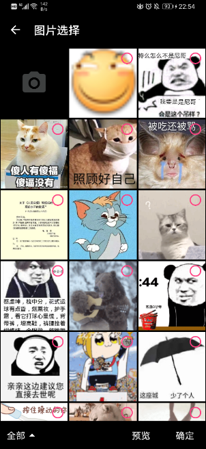
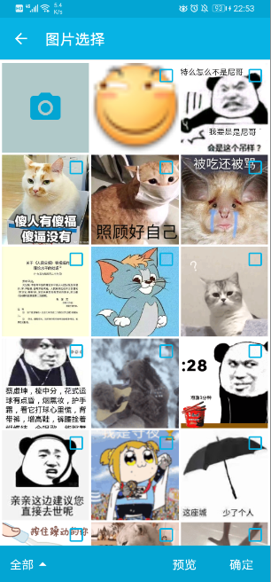
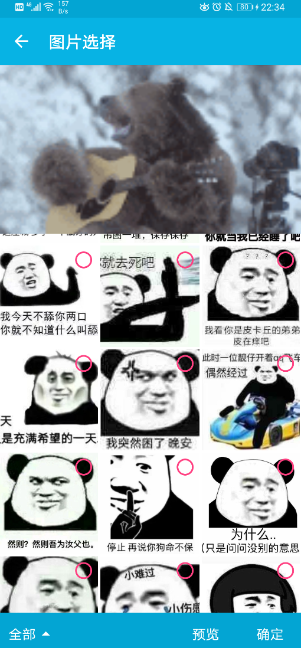

## version

core:

ui:

#### Manifests.xml

        <activity
            android:name="com.gallery.ui.page.GalleryActivity"
            android:theme="@style/Theme.AppCompat.Light.NoActionBar" />
        <activity
            android:name="com.gallery.ui.page.PreActivity"
            android:theme="@style/Theme.AppCompat.Light.NoActionBar" />
            
#### dependencies

    implementation 'com.ydevelop:gallery.ui:0.1.3'
    implementation "com.github.yalantis:ucrop:$ucropVersion"
    implementation "androidx.viewpager2:viewpager2:$viewpagerVersion"
    implementation "com.github.bumptech.glide:glide:$glideVersion"
    
#### demo

    private val galleryLauncher: ActivityResultLauncher<Intent> =
            registerForActivityResult(
                    ActivityResultContracts.StartActivityForResult(), 
                    GalleryResultCallback(this, SimpleGalleryCallback())
            )

    Gallery(
            activity = FragmentActivity,
            galleryLauncher = galleryLauncher,
            // 可选，自定义UI
            clz = SimpleGalleryActivity::class.java,
            galleryBundle = GalleryBundle(),
            galleryUiBundle = GalleryUiBundle()
    )
    
    
#### custom page

  [CustomyActivity](./app/src/main/java/com/gallery/sample/custom/CustomPage.kt)
  
#### custom crop

  [ICrop](./core/src/main/java/com/gallery/core/crop/ICrop.kt)
  
  [UCropImpl](./app/src/main/java/com/gallery/sample/crop/UCropImpl.kt)

#### custom camera

  [CameraActivity](./app/src/main/java/com/gallery/sample/camera/CameraActivity.kt)

## Screenshot

| 黑色                                   | 主题色                                | 蓝色                              | 粉色                                  | 默认
| :----:                                | :----:                                |:----:                             | :----:                               | :----: 
|    |     |  |    |   

| 嵌套                                        | 自定义布局                                | Dialog                                | 预览                                  
| :----:                                      | :----:                                  |:----:                                 | :----:                               
|    |     |   |   