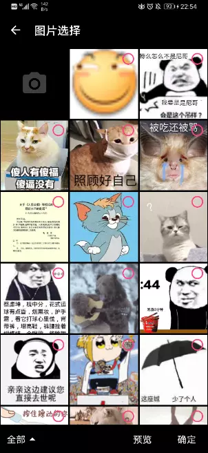
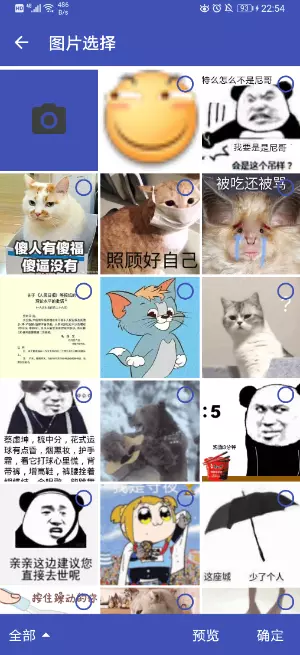
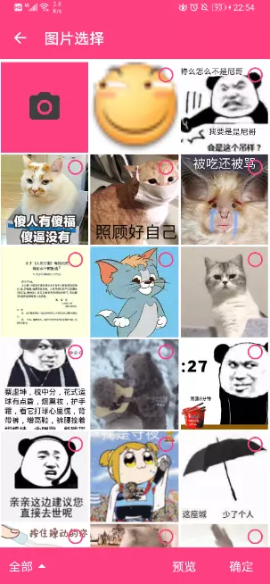
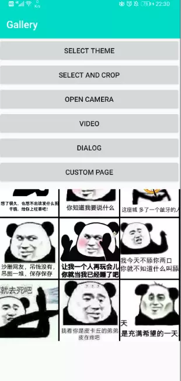
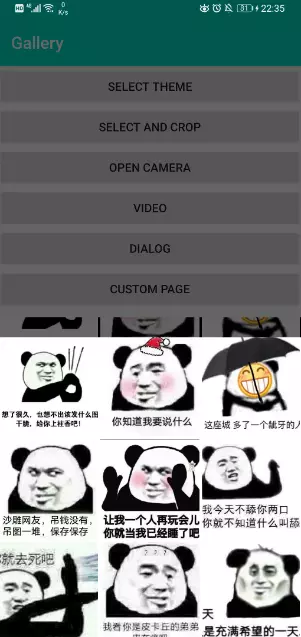

## version

	allprojects {
		repositories {
			maven { url 'https://jitpack.io' }
		}
	}
	

#### dependencies

    implementation "com.github.7449.Album:wechat:$lastVersion"
    implementation "com.github.7449.Album:ui:$lastVersion"
    implementation "com.github.7449.Album:core:$lastVersion"
    implementation "com.github.7449.Album:scan:$lastVersion"
    
#### simple camera

  [SimpleMaterialGalleryCameraActivity](./sample/src/main/java/com/gallery/sample/camera/SimpleMaterialGalleryCameraActivity.kt)
  
  [SimpleCameraActivity](./sample/src/main/java/com/gallery/sample/camera/SimpleCameraActivity.kt)

#### simple dialog

  [SimpleGalleryDialog](./sample/src/main/java/com/gallery/sample/dialog/SimpleGalleryDialog.kt)

## Screenshot

| 黑色                                   | 主题色                                | 蓝色                              | 粉色                                  | 默认
| :----:                                | :----:                                |:----:                             | :----:                               | :----: 
|    |     |  |    |   

| 嵌套                                        | 自定义布局                                | Dialog                                | 预览                                  
| :----:                                      | :----:                                  |:----:                                 | :----:                               
|    |     |   |   