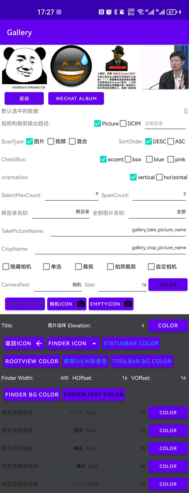

## version

	allprojects {
		repositories {
			maven { url 'https://jitpack.io' }
		}
	}

#### dependencies

    implementation "com.github.7449.Album:wechat:$lastVersion"
    implementation "com.github.7449.Album:ui:$lastVersion"
    implementation "com.github.7449.Album:core:$lastVersion"
    implementation "com.github.7449.Album:scan:$lastVersion"
    implementation "com.github.7449.Album:material:$lastVersion"

#### simple camera

[SimpleMaterialGalleryCameraActivity](./sample/src/main/java/com/gallery/sample/camera/SimpleMaterialGalleryCameraActivity.kt)

[SimpleCameraActivity](./sample/src/main/java/com/gallery/sample/camera/SimpleCameraActivity.kt)

## Screenshot

|                 黑色                  |                主题色                |                 蓝色                 |                 粉色                 |                  默认                   |
|:-----------------------------------:|:---------------------------------:|:----------------------------------:|:----------------------------------:|:-------------------------------------:|
|  |  |  |  |  |

|                    嵌套                     |                自定义布局                 |                Dialog                |                  预览                   |
|:-----------------------------------------:|:------------------------------------:|:------------------------------------:|:-------------------------------------:|
|  |  |  |  |

## Config

